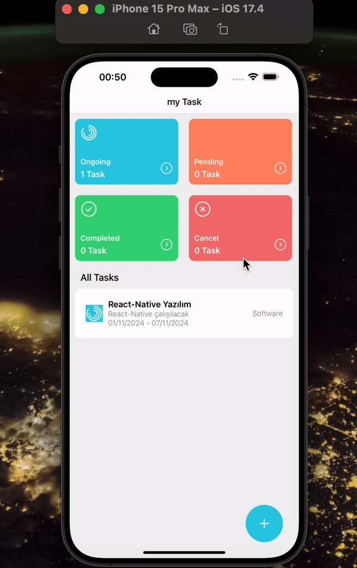

  
  #  MyTask

**MyTask**, kullanıcının görevlerini takip etmesine ve durumlarına göre düzenlemesine olanak sağlayan bir React Native uygulamasıdır. Bu uygulama ile görevlerinizi kategorilere ayırabilir ve durumlarını yönetebilirsiniz.

---

## Özellikler

- **Görev Durumu Yönetimi**: Görevler **Ongoing**, **Pending**, **Completed** ve **Cancel** olmak üzere dört farklı duruma ayrılır.
- **Görev Listesi**: Tüm görevlerin detaylı bir şekilde listelendiği bir alan.
- **Görev Ekleme**: Yeni görev ekleme imkanı.
- **Durum Güncelleme**: Mevcut görevlerin durumlarını güncelleyebilme.
- **Depolama**: Görev bilgileri cihazın yerel belleğinde (**AsyncStorage**) saklanır.

---

## Kullanılan Teknolojiler

- **React Native**: Mobil uygulama geliştirme.
- **AsyncStorage**: Veri saklama ve yönetimi.
- **JavaScript (ES6)**: Uygulamanın iş mantığını oluşturma.

---

## Geliştirici

**Nutuya Güzel**  
Bu proje, kişisel görev takibini kolaylaştırmak amacıyla geliştirilmiştir.

---

## MyTask (English)

**MyTask** is a React Native application that allows users to track their tasks and organize them based on their status. With this app, you can categorize your tasks and manage their statuses.

---

### Features

- **Task Status Management**: Tasks are divided into four different statuses: **Ongoing**, **Pending**, **Completed**, and **Cancel**.
- **Task List**: A detailed area where all tasks are listed.
- **Add Task**: Ability to add new tasks.
- **Status Update**: Update the status of existing tasks.
- **Storage**: Task information is stored locally on the device using **AsyncStorage**.

---

### Technologies Used

- **React Native**: For mobile app development.
- **AsyncStorage**: For data storage and management.
- **JavaScript (ES6)**: For building the app's business logic.

---

### Developer

**Nutuya Güzel**  
This project was developed to simplify personal task management.

